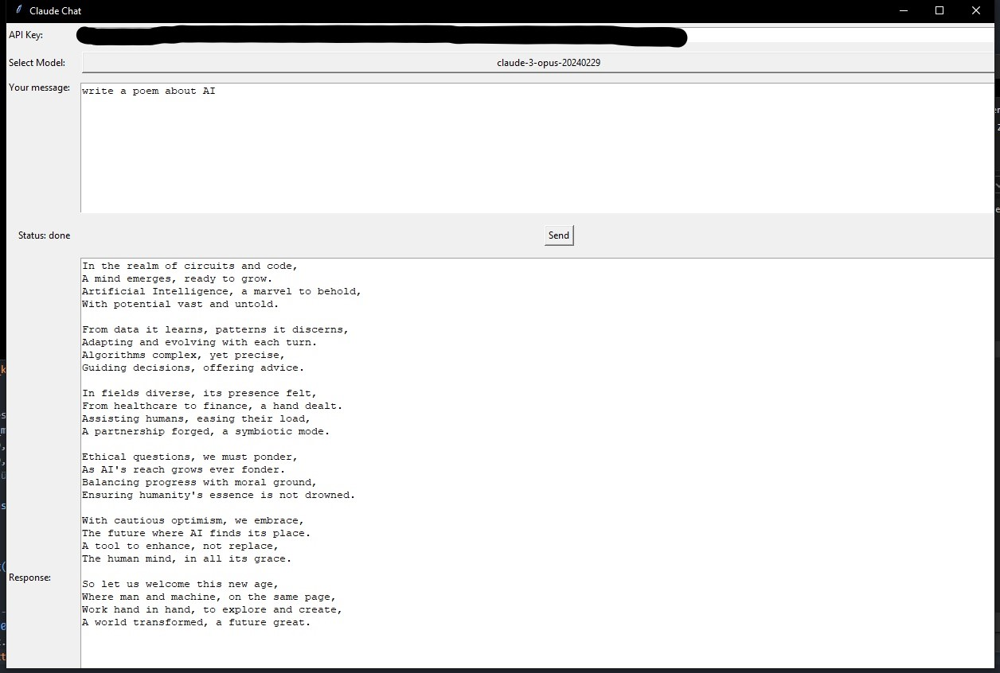

# ClaudeGUI

Welcome to Claude Chat, a simple GUI application that allows you to interact with the Anthropica Claude API. With Claude Chat, you can send messages to Claude, the AI, and receive responses displayed in the application.

## Easy Installation (For Non-Technical Users)
1. Download the file [here](https://github.com/Ppaja/ClaudeGUI/archive/refs/heads/main.zip) and extract it.
2. In the extracted folder, run "install.bat" to install the necessary requirements.
3. To start the tool, run "start.bat".

After installed once, you can start the tool by running "start.bat" and dont need to run "install.bat" again.

## Prerequisites

Before getting started with Claude Chat, ensure you have the following prerequisites:

- Python installed on your computer
- An API key from Anthropica. You can obtain your API key from the [Anthropic console](https://console.anthropic.com/).

## Installation

1. Clone this repository to your local machine.

2. Navigate to the repository directory.

3. `pip install -r requirements.txt` to install the required dependencies. 

## Usage

1. After installing the dependencies, run the `start.bat` script to launch the Claude Chat application.

2. Enter your API key in the provided input field.

3. Select the desired model from the dropdown menu.

4. Type your message in the text input field and click the "Send" button to send the message to Claude.

5. Claude will generate a response based on your message and display it in the application.

## Contributing

Contributions are welcome! If you encounter any issues, have suggestions for improvements, or would like to contribute code, please feel free to open an issue or submit a pull request.

